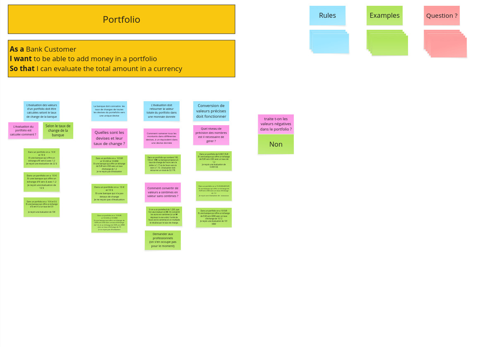

# Example Mapping

## US 1

**Evaluation d'un portfolio de montants dans différentes devises**

### RM 1

**L'évaluation des valeurs d'un portfolio doit être calculée selont le taux de change de la banque.**

> Comment utiliser les taux de change pour évaluer le portfolio ?

Exemple: Dans un portfolio on a 10€ et 10\$. Et une banque qui offre un échange d'€ vers \$ pour un taux d'1.2. Je reçoit une évaluation de 22\$.

- [x] 10\$ + 10 € * 1.2 = 22 \$

Exemple: Dans un portfolio on a 10€. Et une banque qui offre un échange d'€ vers \$ pour 1.2 de change. Je reçoit une évaluation de 12\$

- [x] 10 € * 1.2 = 12 \$

Exemple: Dans un portfolio on a 10€ et 0\$. Et une banque qui offre un échange d'\$ vers € a un taux de 0.9. Je reçoit une évaluation de 9€.

- [x] 10 € + 0 \$ * 0.9 = 10 €

### RM 2

**La banque doit connaitre les taux de change de toutes les devises du portefolio vers une unique devise.**

> Quelles sont les devises et leur taux de change ?

Exemple: Dans un portfolio on a 10 EUR et 10 USD et 10 KRW. Et une banque qui offre un échange de EUR vers USD avec un taux d'échange de 1.2. Je ne reçois pas d'évaluation.

- [x] 10 EUR * 1.2 + 10 USD + 10 KRW * null = null

Exemple: Dans un portfolio on a 10 € et 10 \$. Et une banque qui n'a pas de taux de change. Je ne reçois pas d'évaluation.

- [x] 10 € * null + 10 \$ * null = null

Exemple: Dans un portfolio on a 10 EUR et 10 USD et 10 KRW. Et une banque qui offre un échange de EUR vers USD avec un taux d'échange de 1.2, et un échange de EUR vers KRW avec un taux d'échange de 10. Je ne reçois pas d'évaluation.

- [x] 10 EUR * 1.2 + 10 USD + 10 KRW * 10 = 120 USD + 10 USD + 100 KRW = 130 USD + 100 KRW

### RM 3

**L'évaluation doit retourner la valeur totale du portfolio dans une monnaie donnée.**

> Comment ramener tous les montants dans différentes devises, à un équivalent dans une devise donnée ?

Exemple: Dans un portfolio qui contient 10€, 10\$ et 10₩. La banque propose un taux de change de l'euro vers le dollar à 1.17 et de l'euro vers le won à 1.10. L'évaluation doit retourner un total de 32.17€.

- [x] 10€ + 10\$ * 1.17 + 10₩ * 1.10 = 10€ + 11.7€ + 11€ = 32.7€

> Comment convertir d'une devise sans centime à une devise avec centime ?

Exemple: Si on a un portefeuil de 1.22€, que l'on veut évaluer en ₩. On convertit les euros en centimes (si un ₩ équivaut à une unité, l'unité de l'euro est le centime) et on multiplie le résultat par le taux de change.

- [x] 1.22€ * 100 = 122 centimes d'euro. 122 centimes d'euro * 1.10 = 134.2 ₩

### RM 4
**La conversion de valeurs précises doit fonctionner.**

> Quel niveau de précision des nombres est il nécessaire de gérer ?

Exemple: Dans un portfolio de 0.0001 EUR. Et une banque qui offre un échange de EUR vers USD avec un taux de 1.2. Je reçois une évaluation de 0.00012\$

- [x] 0.0001 EUR * 1.2 = 0.00012 USD

Exemple: Dans un portfolio on a 10.2545648 EUR
Et une banque qui offre un échange de EUR vers USD avec un taux d'échange de 1.2. Je reçois une évaluation de 12.30547776.

- [x] 10.2545648 EUR * 1.2 = 12.30547776 USD