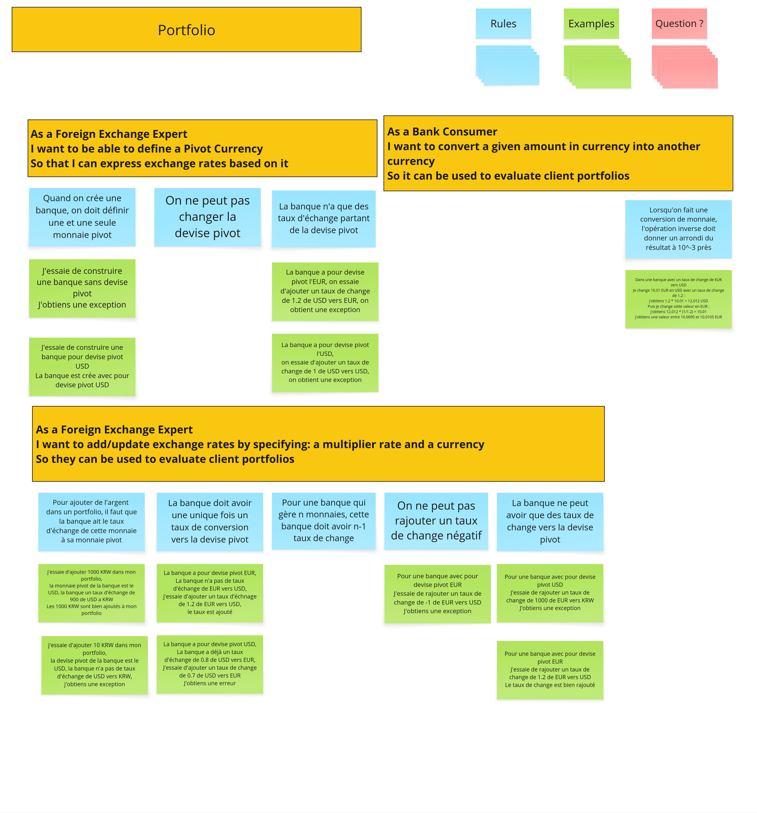

# Example Mapping



## Story 1: Define Pivot Currency
```gherkin
As a Foreign Exchange Expert
I want to be able to define a Pivot Currency
So that I can express exchange rates based on it
```

> Une fois la banque créée, peut-on ajouter d'autres devises pivots secondaires ?

### Règle Métier: Une banque doit avoir une et une seule monnaie pivot à sa création.

```gherkin
Given je construis une banque avec pour devise pivot USD
Then la banque est créée avec pour devise pivot USD
```

### Règle Métier: On ne peut pas créer une banque sans devise pivot.

```gherkin
Given j'essaie de construire une banque sans devise pivot
Then j'obtiens une exception
```

### Règle Métier: On ne peut pas changer la devise pivot d'une banque existante.

```gherkin
Given une banque avec pour devise pivot l'EUR
When j'essaie de changer la devise pivot
Then l'opération échoue
```

## Story 2: Add an exchange rate
```gherkin
As a Foreign Exchange Expert
I want to add/update exchange rates by specifying: a multiplier rate and a currency
So they can be used to evaluate client portfolios
```

> Peut-on avoir un taux de change d'une devise non-pivot vers une autre devise non-pivot si cela simplifie des calculs fréquents ?

### Règle Métier: La banque ne peut avoir que des taux de change depuis la devise pivot vers une autre devise.

```gherkin
Given une banque avec pour devise pivot USD
When j'essaie d'ajouter un taux de change de 1000 de EUR vers KRW
Then j'obtiens une exception
```

### Règle Métier: La banque doit avoir un seul taux de conversion par devise (de la pivot vers une autre).

```gherkin
Given une banque avec pour devise pivot USD et un taux existant de 0.8 de USD vers EUR
When j'essaie d'ajouter un nouveau taux de 0.7 de USD vers EUR
Then j'obtiens une erreur
```

### Règle Métier: On ne peut pas ajouter un taux de change négatif.

```gherkin
Given une banque avec pour devise pivot EUR
When j'essaie d'ajouter un taux de change de -1 de EUR vers USD
Then j'obtiens une exception
```

### Règle Métier: On ne peut pas ajouter un taux pour la devise pivot vers elle-même.

```gherkin
Given une banque a pour devise pivot l'USD
When on essaie d'ajouter un taux de change de 1 de USD vers USD
Then on obtient une exception
```

## Story 3: Convert a Money

```gherkin
As a Bank Consumer
I want to convert a given amount in currency into another currency
So it can be used to evaluate client portfolios
```

> Que se passe-t-il si nous voulons convertir dans une devise inconnue du système ?

### Règle Métier: Pour ajouter de l'argent dans un portfolio, la banque doit avoir le taux de cette monnaie vers la monnaie pivot.

```gherkin
Given une banque avec pour devise pivot USD et un taux d'échange de 900 de USD vers KRW
When j'essaie d'ajouter 1000 KRW dans mon portfolio
Then les 1000 KRW sont bien ajoutés à mon portfolio
```

```gherkin
Given une banque avec pour devise pivot USD et sans taux d'échange de USD vers KRW
When j'essaie d'ajouter 10 KRW dans mon portfolio
Then j'obtiens une exception
```

### Règle Métier: Une conversion de monnaie, suivie de l'opération inverse, doit redonner un résultat à 10⁻³ près du montant original (Round-Tripping).

```gherkin
Given une banque avec pour devise pivot l'EUR et un taux de change de 1.2 de EUR vers USD
When je change 10.01 EUR en USD (j'obtiens 12.012 USD) et que je change cette valeur en EUR
Then j'obtiens une valeur entre 10.0095 et 10.0105 EUR
```

### Règle Métier: La conversion utilise le taux depuis la devise pivot.

```gherkin
Given une banque avec pour devise pivot EUR et un taux de change de 1.2 de EUR vers USD
When je convertis 10 EUR en USD
Then je reçois 12 USD
```