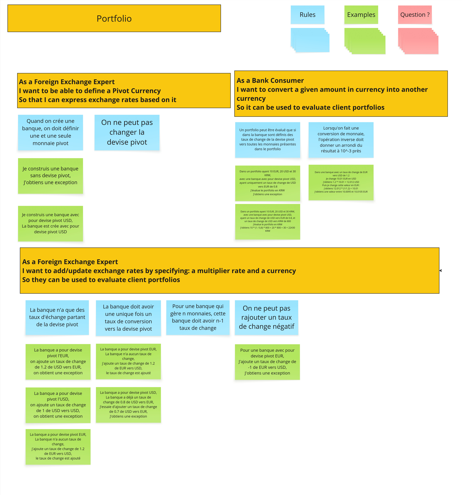

# Example Mapping



## Story 1: Define Pivot Currency
```gherkin
As a Foreign Exchange Expert
I want to be able to define a Pivot Currency
So that I can express exchange rates based on it
```

> Une fois la banque créée, peut-on ajouter d'autres devises pivots secondaires ?

### Règle Métier: Une banque doit avoir une et une seule monnaie pivot à sa création.

```gherkin
Given je construis une banque avec pour devise pivot USD
Then la banque est créée avec pour devise pivot USD
```

### Règle Métier: On ne peut pas créer une banque sans devise pivot.

```gherkin
Given je construis une banque sans devise pivot
Then j'obtiens une exception
```

### Règle Métier: On ne peut pas changer la devise pivot d'une banque existante.

```gherkin
Given une banque avec pour devise pivot l'EUR
When je change la devise pivot
Then l'opération échoue
```

## Story 2: Add an exchange rate
```gherkin
As a Foreign Exchange Expert
I want to add/update exchange rates by specifying: a multiplier rate and a currency
So they can be used to evaluate client portfolios
```

> Peut-on avoir un taux de change d'une devise non-pivot vers une autre devise non-pivot si cela simplifie des calculs fréquents ?

### Règle Métier: La banque ne peut avoir que des taux de change depuis la devise pivot vers une autre devise.

```gherkin
Given une banque avec pour devise pivot USD et sans taux de change
When j'ajoute un taux de change de 0.8 de USD vers EUR
Then le taux de change est ajouté
```

```gherkin
Given une banque avec pour devise pivot USD
When j'ajoute un taux de change de 1000 de EUR vers KRW
Then j'obtiens une exception
```

```gherkin
Given une banque avec pour devise pivot USD
When j'ajoute un taux de change de 1.2 de EUR vers USD
Then j'obtiens une exception
```

### Règle Métier: La banque doit avoir un seul taux de conversion par devise (de la pivot vers une autre).

```gherkin
Given une banque avec pour devise pivot USD et un taux existant de 0.8 de USD vers EUR
When j'ajoute un nouveau taux de 0.7 de USD vers EUR
Then j'obtiens une erreur
```

```gherkin
Given une banque avec pour devise pivot USD et sans taux de change
When j'ajoute un taux de change de 0.8 de USD vers EUR
Then le taux de change est ajouté
```

### Règle Métier: On ne peut pas ajouter un taux de change négatif.

```gherkin
Given une banque avec pour devise pivot EUR
When j'ajoute un taux de change de -1 de EUR vers USD
Then j'obtiens une exception
```

### Règle Métier: On ne peut pas ajouter un taux pour la devise pivot vers elle-même.

```gherkin
Given une banque avec pour devise pivot USD
When j'ajoute un taux de change de 1 de USD vers USD
Then j'obtiens une exception
```

## Story 3: Convert a Money

```gherkin
As a Bank Consumer
I want to convert a given amount in currency into another currency
So it can be used to evaluate client portfolios
```

> Comment obtenir la valeur du portfolio à l'aide de la devise pivot

### Règle Métier: Un portfolio peut être évalué que si dans la banque sont définis des taux de change de la devise pivot vers toutes les monnaies présentes dans le portfolio

```gherkin
Given un portfolio ayant 10 EUR, 20 USD, 30 KRW et une banque avec pour devise pivot USD ayant uniquement un taux de change de USD vers EUR de 0.8
When j'évalue le portfolio en KRW
Then j'obtiens une exception
```

```gherkin
Given un portfolio ayant 10 EUR, 20 USD, 30 KRW et une banque avec pour devise pivot USD ayant un taux de change de USD vers EUR de 0.8, et un taux de change de USD vers KRW de 800
When j'évalue le portfolio en KRW
Then j'obtiens 10 * (1 / 0.8) * 800 + 20 * 800 + 30 = 22430 KRW
```

### Règle Métier: Une conversion de monnaie, suivie de l'opération inverse, doit redonner un résultat à 10⁻³ près du montant original (Round-Tripping).

```gherkin
Given une banque avec pour devise pivot l'EUR et un taux de change de 1.2 de EUR vers USD
When je change 10.01 EUR en USD (j'obtiens 1.2 * 10.01 = 12.012 USD) et que je change cette valeur en EUR (12.012 * (1 / 1.2) = 10.01)
Then j'obtiens une valeur entre 10.0095 et 10.0105 EUR
```